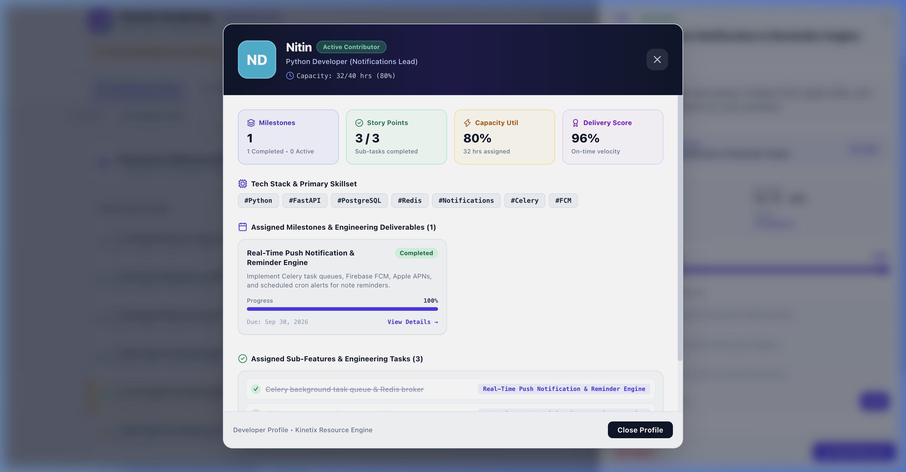

# 📘 Kinetix Roadmap User Manual & Feature Guide

Welcome to the **Kinetix Roadmap** User Manual! This guide provides comprehensive, step-by-step instructions on how to use every feature in Kinetix Roadmap, complete with visual screenshot references and workflow tips.

---

## 🚀 Featured Project: KeepNote Ecosystem

This deployment is pre-loaded with **KeepNote Ecosystem** (a Google Keep alternative note-taking platform).

### Team Structure:
- **Anurag** — Engineering Manager & Product Lead
- **Jitendra** — Senior Python Developer (FastAPI Architecture & Database Schema)
- **Nitin** — Python Developer (Push Notifications & Scheduled Reminders)
- **Ram** — Senior Frontend Developer (React Web Dashboard & TipTap Editor)
- **Akshay** — Frontend Developer (React Native iOS & Android App)
- **Dinesh** — Lead QA Engineer (PyTest, Cypress E2E & Load Testing)
- **Shyam** — DevOps Engineer (Docker, AWS ECS Infrastructure & CI/CD)

---

## 📑 Table of Contents
1. [Getting Started](#1-getting-started)
2. [Dedicated Developer Profile Dashboard](#2-dedicated-developer-profile-dashboard)
3. [Roadmap & Interactive Gantt Timeline](#3-roadmap--interactive-gantt-timeline)
4. [2x2 Priority Matrix & Kinetix RICE Scorecard](#4-2x2-priority-matrix--kinetix-rice-scorecard)
5. [Drag-and-Drop Kanban Board](#5-drag-and-drop-kanban-board)
6. [Dependency Graph Visualizer](#6-dependency-graph-visualizer)
7. [Strategic Goals Hub](#7-strategic-goals-hub)
8. [Ideas Portal & 1-Click Promotion](#8-ideas-portal--1-click-promotion)
9. [Resource Workload & Capacity Planning](#9-resource-workload--capacity-planning)
10. [Guided Interactive Onboarding Tour](#10-guided-interactive-onboarding-tour)
11. [Data Backup, Export & Import](#11-data-backup-export--import)

---

## 1. Getting Started

When you launch Kinetix Roadmap (`npm run dev` at `http://localhost:5173`), you are greeted with the main application header featuring:
- **Navigation Tabs**: Switch between Roadmap, Priority Matrix, Dependency Graph, Goals Hub, Ideas Portal, Workload, and Kanban Board.
- **Data Action Buttons**: Export JSON, Export CSV, and Import Data.
- **Help & Tour Button**: Launches the interactive step-by-step guided onboarding tour.

---

## 2. Dedicated Developer Profile Dashboard

Every developer name (*Anurag, Jitendra, Nitin, Ram, Akshay, Dinesh, Shyam*) throughout Kinetix Roadmap is **100% interactive and clickable**.

### How to Access:
- **From Detail Drawer**: Open any milestone details and click on **Assigned Lead: [Developer Name]**.
- **From Kanban Cards**: Click the developer name on the bottom-right of any card.
- **From Team Capacity Dashboard**: Click any team member card under **Developer Metrics & Team Capacity Dashboard**.

### What's Inside the Profile:
- **Developer Metrics Banner**: Avatar initials, official role, and weekly capacity utilization percentage (*e.g., Nitin — 32/40 hrs, 80% capacity*).
- **Key Metrics Scorecards**: Assigned Milestones Count, Completed Story Points, Delivery Velocity Score (96%), and Capacity Utilization.
- **Tech Stack & Primary Skillsets**: Auto-generated tech badges (*e.g., #Python, #FastAPI, #Celery, #FCM, #Redis, #React, #Docker*).
- **Assigned Milestones Grid**: Interactive list of all milestones owned by this developer. Click any milestone card to open its detail view directly!
- **Assigned Sub-Features & Tasks Checklist**: Full checklist of engineering tasks owned by this team member across the project.

---

## 3. Roadmap & Interactive Gantt Timeline

The **Kinetix Roadmap & Gantt** module is the core execution engine. It displays 8 core engineering milestones for the KeepNote project with **~60% overall progress completed**.

### Core Interactions:

#### A. Drag-and-Drop Milestone Rescheduling
1. Click and hold any milestone box in the Gantt chart.
2. Drag left or right to shift the start and due dates visually.
3. Release the mouse button — dates update automatically, and connected dependency arrows re-route in real-time.

#### B. Connecting Milestone Dependencies via Drag-and-Drop
1. Hover over any milestone box to reveal the **connection handles** on the right edge.
2. Click and drag a line from the handle of a prerequisite milestone (*e.g. FastAPI Backend*) to a target milestone (*e.g. React Native Mobile App*).
3. Release the line over the target milestone to establish a new dependency connection.

#### C. Filtering & Detail Drawer
- Use the **Filter Controls** at the top to filter by Goal, Status, or Health.
- Click any milestone box to open the **Slide-Over Detail Drawer**. Click the lead's name to view their **Developer Profile Dashboard**.

---

## 4. 2x2 Priority Matrix & Kinetix RICE Scorecard

Prioritize features objectively using 2x2 Effort vs Impact quadrants and the RICE scorecard.

### A. 2x2 Effort vs. Impact Matrix
- **⚡ Quick Wins (High Impact, Low Effort)**: FastAPI Async REST endpoints, Docker Containerization.
- **🎯 Major Projects (High Impact, High Effort)**: React Native Mobile App, WebSockets Live Co-editing.
- **🌱 Fill-ins (Low Impact, Low Effort)**: Scheduled cron workers.
- **⚠️ Thankless Tasks (Low Impact, High Effort)**: Legacy data migrators.

### B. Kinetix RICE Prioritization Scorecard
$$\text{RICE Score} = \frac{\text{Reach} \times \text{Impact} \times \text{Confidence}}{\text{Effort}}$$

---

## 5. Drag-and-Drop Kanban Board

Track daily task execution across KeepNote milestones with assigned team members.

---

## 6. Dependency Graph Visualizer

Understand cross-team dependencies and critical paths between Python backend, mobile app, QA testing, and DevOps milestones.

---

## 7. Strategic Goals Hub

Track progress against KeepNote core objectives:
1. **Core Engine & Real-Time Sync Infrastructure** (80% Progress)
2. **Cross-Platform Mobile App (iOS & Android)** (55% Progress)
3. **Real-Time Push Notification & Reminder Engine** (100% Progress)
4. **Multi-Platform Workspace Note Sharing** (40% Progress)

---

## 8. Ideas Portal & 1-Click Promotion

Gather feature requests for KeepNote:
- **Whisper AI Voice Note Auto-Transcription** (185 Upvotes — *Promoted*)
- **End-to-End Encrypted Private Vault Notes** (142 Upvotes — *Approved*)

---

## 9. Resource Workload & Capacity Planning

Monitor assigned capacity for **Anurag**, **Jitendra**, **Nitin**, **Ram**, **Akshay**, **Dinesh**, and **Shyam**.

---

## 10. Guided Interactive Onboarding Tour

Click **Help & Tour** in the top navigation bar to launch the spotlight tour with high-contrast unblurred target frames.

---

## 11. Data Backup, Export & Import

- **Export CSV**: Downloads `kinetix_milestones.csv`
- **Export JSON**: Downloads `kinetix_roadmap_export.json`
- **Import Data**: Upload JSON backup file to restore workspace state.

---

*Thank you for using **Kinetix Roadmap**! For updates and contributions, visit [github.com/anubioinfo/kinetix](https://github.com/anubioinfo/kinetix).*
