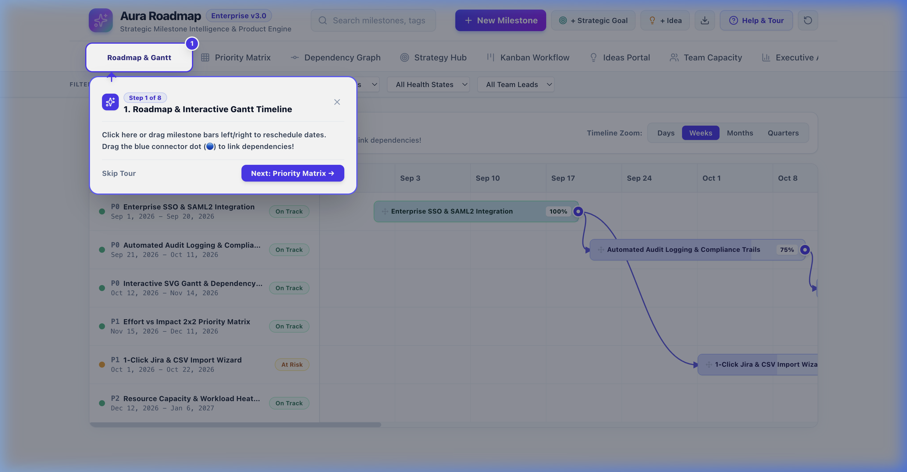

# 📘 Kinetix User Manual & Feature Guide

Welcome to the **Kinetix** User Manual! This guide provides comprehensive, step-by-step instructions on how to use every feature in Kinetix, complete with visual screenshot references and workflow tips.

---

## 📑 Table of Contents
1. [Getting Started](#1-getting-started)
2. [Roadmap & Interactive Gantt Timeline](#2-roadmap--interactive-gantt-timeline)
3. [2x2 Priority Matrix & RICE Scorecard](#3-2x2-priority-matrix--rice-scorecard)
4. [Drag-and-Drop Kanban Board](#4-drag-and-drop-kanban-board)
5. [Dependency Graph Visualizer](#5-dependency-graph-visualizer)
6. [Strategic Goals Hub](#6-strategic-goals-hub)
7. [Ideas Portal & 1-Click Promotion](#7-ideas-portal--1-click-promotion)
8. [Resource Workload & Capacity Planning](#8-resource-workload--capacity-planning)
9. [Guided Interactive Onboarding Tour](#9-guided-interactive-onboarding-tour)
10. [Data Backup, Export & Import](#10-data-backup-export--import)

---

## 1. Getting Started

When you launch Kinetix (`npm run dev` at `http://localhost:5173`), you are greeted with the main application header featuring:
- **Navigation Tabs**: Seamlessly switch between Roadmap, Priority Matrix, Dependency Graph, Goals Hub, Ideas Portal, Workload, and Kanban Board.
- **Data Action Buttons**: Export JSON, Export CSV, and Import Data.
- **Help & Tour Button**: Launches the interactive step-by-step guided onboarding tour.

---

## 2. Roadmap & Interactive Gantt Timeline

The **Roadmap & Gantt** module is the core execution engine of Kinetix. It provides a visual timeline of all product milestones grouped by strategic goals.

### Core Interactions:

#### A. Drag-and-Drop Milestone Rescheduling
1. Click and hold any milestone box in the Gantt chart.
2. Drag left or right to shift the start and due dates visually.
3. Release the mouse button — the milestone dates update automatically, and all connected dependency arrows adjust smoothly in real-time.

#### B. Connecting Milestone Dependencies via Drag-and-Drop
1. Hover over any milestone box to reveal the **connection handles** on the right edge.
2. Click and drag a line from the handle of a prerequisite milestone to a target milestone.
3. Release the line over the target milestone to establish a new dependency connection.

#### C. Filtering & Viewing Milestone Details
- Use the **Filter Controls** at the top of the roadmap to filter by Goal, Status (*Completed, In Progress, Planning*), or Health (*On Track, At Risk, Delayed*).
- Click any milestone box to open the **Slide-Over Detail Drawer** for deep editing of progress %, assigned owner, impact/effort scores, and risk notes.

---

## 3. 2x2 Priority Matrix & RICE Scorecard

Prioritize your product roadmap objectively using two industry-standard prioritization frameworks.

### A. 2x2 Effort vs. Impact Matrix
Switch to the **2x2 Matrix** tab to see your features automatically plotted into 4 distinct quadrants:
- **⚡ Quick Wins (High Impact, Low Effort)**: Priority items to execute immediately.
- **🎯 Major Projects (High Impact, High Effort)**: Strategic initiatives requiring scheduled roadmap planning.
- **🌱 Fill-ins (Low Impact, Low Effort)**: Low-hanging fruit for downtime.
- **⚠️ Thankless Tasks (Low Impact, High Effort)**: Candidates for deprioritization or scope reduction.

### B. RICE Prioritization Scorecard
Click the **RICE Scorecard** tab to switch to a structured table ranking features by their calculated RICE score:

$$\text{RICE Score} = \frac{\text{Reach} \times \text{Impact} \times \text{Confidence}}{\text{Effort}}$$

---

## 4. Drag-and-Drop Kanban Board

Track daily task execution with an agile **Kanban Board** supporting intuitive drag-and-drop column transitions.

### How to Move Tasks:
1. Click and hold any task card in the **Backlog**, **In Progress**, **Review**, or **Completed** columns.
2. Drag the card into a new column.
3. As you drop cards into **Completed**, the progress bar automatically updates to 100% with a green completion indicator.

---

## 5. Dependency Graph Visualizer

Understand cross-team dependencies and critical paths with an SVG-rendered node network.

- Nodes represent milestones, colored by their health (*Green = On Track, Orange = At Risk, Red = Delayed*).
- Arrows indicate prerequisite relationships to highlight risk propagation across teams.

---

## 6. Strategic Goals Hub

Ensure every engineering initiative aligns with corporate objectives.

- **Goal Metric Cards**: Track key results (*e.g., Enterprise ARR, User Retention, System Uptime*).
- **Milestone Alignment Matrix**: View which milestones support each strategic goal and track overall goal progress percentages.

---

## 7. Ideas Portal & 1-Click Promotion

Gather customer feedback and promote validated feature requests straight to your roadmap.

### 1-Click Milestone Promotion:
1. Browse submitted ideas in the portal.
2. Click the **Upvote** button to increment community interest.
3. When an idea is validated, click **Promote to Milestone** — Kinetix automatically converts the idea into an active roadmap milestone!

---

## 8. Resource Workload & Capacity Planning

Prevent team burnout by monitoring resource allocation across team members.

- View assigned workloads for Frontend Engineers, Backend Engineers, Product Designers, and QA leads.
- Automatically flags over-allocated team members working on multiple simultaneous milestones.

---

## 9. Guided Interactive Onboarding Tour

Kinetix includes a step-by-step interactive walk-through tour with an unblurred target spotlight ring.

### How to Use the Tour:
1. Click **Help & Tour** in the top navigation bar at any time.
2. The tour highlights the key element with a bright spotlight frame and solid high-contrast badge.
3. Click **Next** to step through each module, or click **Skip Tour** to exit whenever you want.

---

## 10. Data Backup, Export & Import

Keep your roadmap safe with built-in export and import features located in the header.

- **Export CSV**: Click **Export CSV** to download `kinetix_milestones.csv` for analysis in Excel or Google Sheets.
- **Export JSON**: Click **Export JSON** to save a full backup of your roadmap, goals, ideas, and kanban state (`kinetix_roadmap_export.json`).
- **Import Data**: Click **Import Data** to upload a previously exported JSON backup file to instantly restore your data.

---

*Thank you for using **Kinetix**! For updates and contributions, visit the repository at [github.com/anubioinfo/kinetix](https://github.com/anubioinfo/kinetix).*
