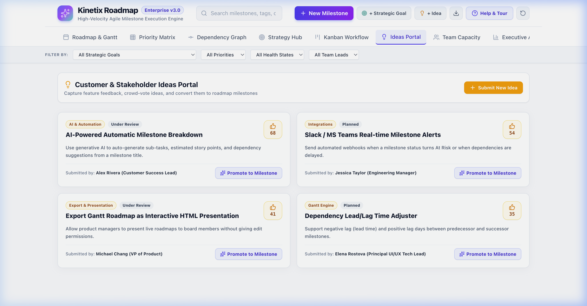

# Kinetix Roadmap — High-Velocity Agile Milestone Execution Engine

> **Enterprise-grade product strategy, interactive roadmap Gantt visualization, RICE scoring engine, and agile execution platform built for high-velocity teams.**

---

## 🌟 Key Features Overview

- 📅 **Interactive Drag-and-Drop Gantt Roadmap**: Schedule milestones visually by dragging milestone bars across the timeline and draw dependency arrows interactively.
- 🎯 **2x2 Priority Matrix & Kinetix RICE Scorecard**: Evaluate feature effort vs. impact in a 4-quadrant dynamic grid or calculate RICE scores (*Reach × Impact × Confidence ÷ Effort*) in a structured table.
- 📋 **Interactive Drag-and-Drop Kanban Board**: Move agile workflow tasks smoothly across *Backlog*, *In Progress*, *Review*, and *Completed* columns with live progress updates.
- 🎯 **Strategic Goal Hub**: Map product milestones directly to enterprise strategic objectives and monitor ROI & metric achievement.
- 💡 **Ideas Portal with 1-Click Milestone Promotion**: Capture customer feedback and promote validated ideas into scheduled roadmap milestones with a single click.
- 👥 **Resource Workload & Capacity Planner**: View team allocation across engineers and designers to prevent burnout and resource bottlenecks.
- 🎓 **Guided Interactive Onboarding Tour**: Step-by-step unblurred target spotlight tour that walks new users through every core feature.
- 📤 **CSV & JSON Data Import/Export**: Backup or migrate product roadmaps effortlessly with complete data export and import support.
- 🎨 **Soft Pastel Light Aesthetic**: Designed with modern typography, smooth pastel badges, glassmorphism panels, and intuitive micro-interactions.

---

## 🖼️ Kinetix Roadmap Feature Screenshots

### 1. Interactive Gantt Roadmap & Timeline


### 2. 2x2 Priority Matrix & Kinetix RICE Scorecard


### 3. Kinetix RICE Prioritization Scorecard


### 4. Interactive Drag & Drop Kanban Workflow


### 5. Dependency Graph Network


### 6. Strategic Goals Hub


### 7. Ideas Portal & 1-Click Promotion


> **For complete visual guides and step-by-step instructions for all screens, see the [📖 Complete Kinetix User Manual](./MANUAL.md).**

---

## 🚀 Quick Start & Installation Instructions

### Prerequisites
Make sure you have Node.js (v18.0.0 or higher) and `npm` installed on your machine.

```bash
# Verify Node.js version
node -v
# Output should be v18.x.x or higher (e.g. v22.x.x)
```

### Installation Steps

1. **Clone the Repository**
   ```bash
   git clone https://github.com/anubioinfo/kinetix.git
   cd kinetix
   ```

2. **Install Dependencies**
   ```bash
   npm install
   ```

3. **Start Development Server**
   ```bash
   npm run dev
   ```
   Open your browser and navigate to **`http://localhost:5173`** (or `http://127.0.0.1:5173`).

4. **Build for Production**
   ```bash
   npm run build
   ```
   The compiled production assets will be generated in the `dist/` directory.

5. **Preview Production Build Locally**
   ```bash
   npm run preview
   ```

---

## 🛠️ Technology Stack

- **Framework**: [React 19](https://react.dev/)
- **Build Tool & Dev Server**: [Vite 8](https://vitejs.dev/)
- **Styling & CSS System**: [Tailwind CSS v4](https://tailwindcss.com/) + Custom Glassmorphism System
- **Icons**: [Lucide React](https://lucide.dev/)
- **State Management**: React Context API (`ProjectContext`) with LocalStorage Persistence
- **Linting & Quality**: Oxlint

---

## 📂 Project Structure

```
kinetix/
├── docs/
│   └── images/                # Fresh Kinetix screenshots for README & Manual
├── src/
│   ├── components/            # UI components (Header, OnboardingTour, DetailDrawer, etc.)
│   ├── context/               # Global state (ProjectContext for roadmap & board state)
│   ├── data/                  # Initial mock dataset for milestones, goals, & ideas
│   ├── utils/                 # Export/Import CSV & JSON helpers
│   ├── views/                 # Core view modules:
│   │   ├── RoadmapGanttView.jsx    # Drag-and-drop Gantt timeline & line drawing
│   │   ├── PriorityMatrixView.jsx  # 2x2 Matrix & Kinetix RICE Scorecard
│   │   ├── DependencyGraphView.jsx # SVG Dependency node graph
│   │   ├── StrategyHubView.jsx     # Goals & Strategic alignment matrix
│   │   ├── IdeasPortalView.jsx     # Ideas capturing & 1-click promotion
│   │   ├── WorkloadView.jsx        # Resource allocation & capacity planning
│   │   └── KanbanBoardView.jsx     # Drag-and-drop Kanban workflow
│   ├── App.jsx                # Layout wrapper & main navigation handler
│   └── main.jsx               # React DOM entrypoint
├── MANUAL.md                  # Comprehensive Step-by-Step User Manual
├── README.md                  # Project overview & quick start guide
└── package.json               # Dependencies and scripts
```

---

## 📖 User Manual & Documentation

For detailed walkthroughs, keyboard shortcuts, interactive drag-and-drop guides, and full feature manuals, check out **[MANUAL.md](./MANUAL.md)**.

---

## 📄 License

Distributed under the MIT License. See `LICENSE` for more information.
