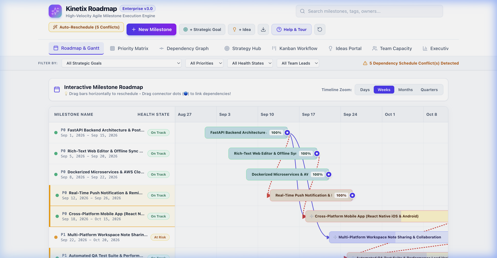
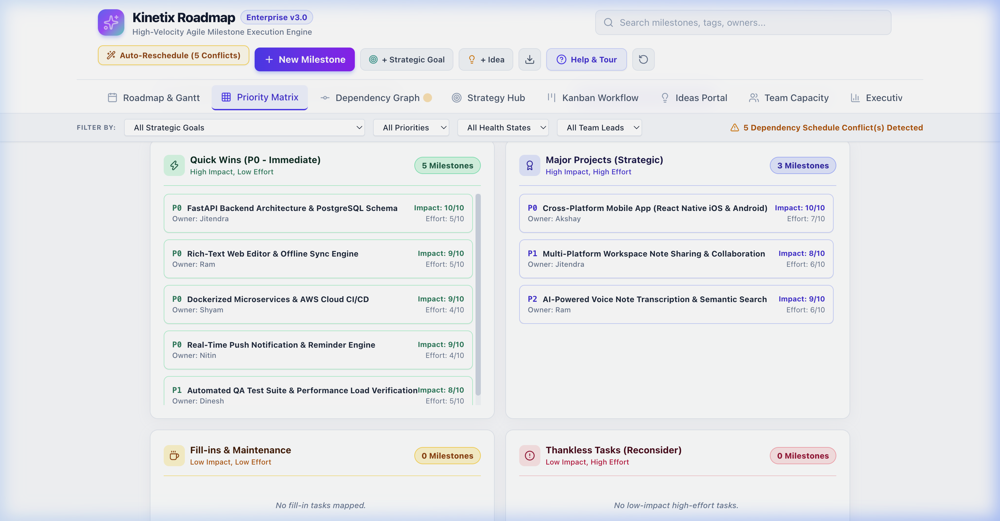
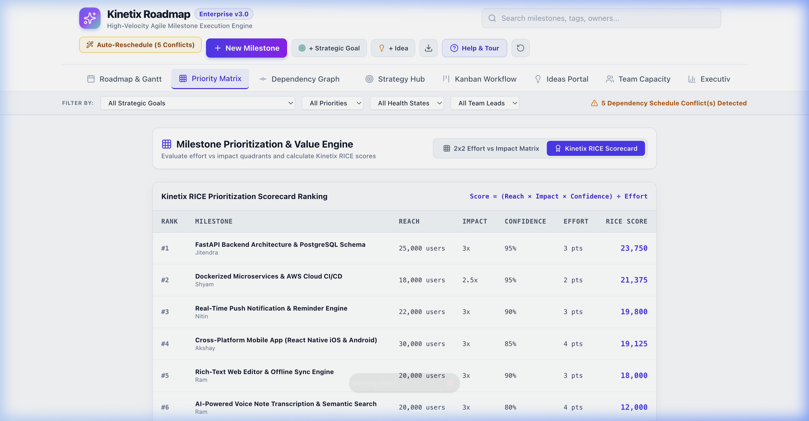
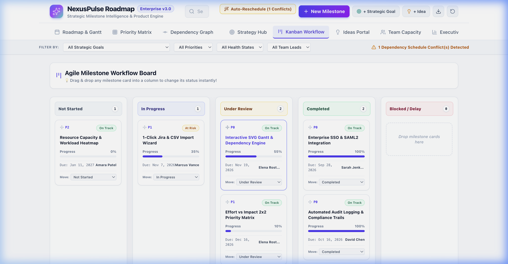
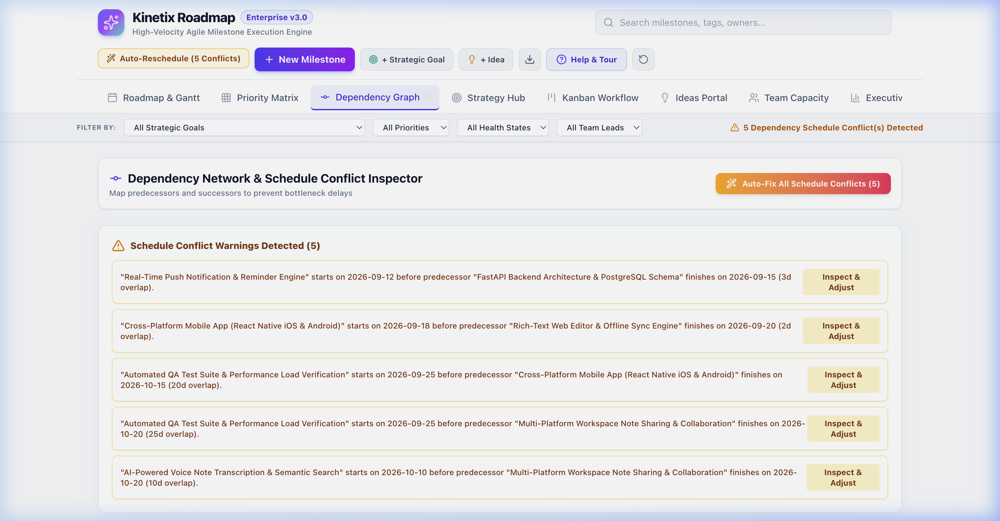
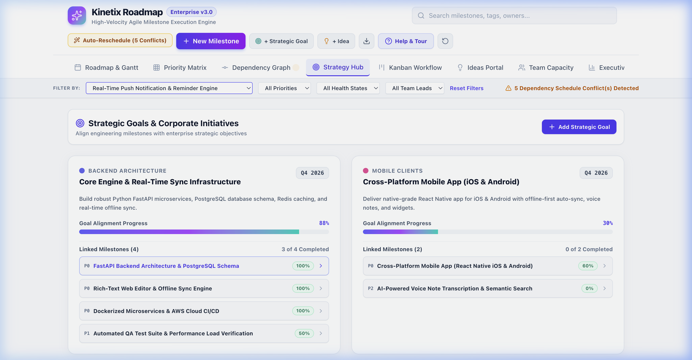
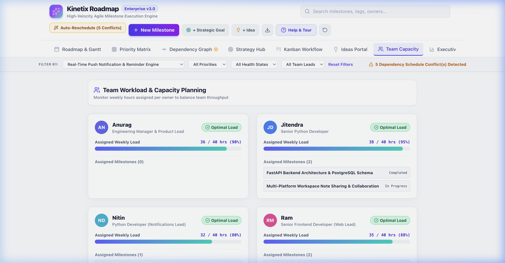

# Kinetix Roadmap — High-Velocity Agile Milestone Execution Engine

> **Enterprise product strategy, interactive Gantt roadmap visualization, RICE prioritization engine, and agile execution platform built for high-velocity teams.**

---

## 🚀 Active Project: KeepNote Ecosystem (Google Keep Alternative)

Kinetix Roadmap is pre-configured with a real-world software engineering project: **KeepNote Ecosystem** — a cross-platform note-taking engine with real-time cloud synchronization, push notifications, voice note transcription, and workspace note sharing.

### 👥 Team Members & Roles
- **Anurag**: Engineering Manager & Product Lead (Roadmap Oversight)
- **Jitendra**: Senior Python Developer (FastAPI Architecture, Backend REST & DB Schema)
- **Nitin**: Python Developer (Firebase FCM & APNs Push Notification Engine)
- **Ram**: Senior Frontend Developer (React Web Dashboard & TipTap Rich-Text Editor)
- **Akshay**: Frontend Developer (React Native iOS & Android Mobile Application)
- **Dinesh**: Lead QA Engineer (PyTest API Suite, Cypress Web E2E & Load Testing)
- **Shyam**: DevOps Engineer (Docker Containers, AWS ECS Infrastructure & GitHub Actions CI/CD)

---

## 🌟 Key Features Overview

- 📅 **Interactive Drag-and-Drop Gantt Roadmap**: Schedule milestones visually by dragging timeline bars left or right, and connect prerequisite milestone dependency arrows interactively.
- 🎯 **2x2 Priority Matrix & Kinetix RICE Scorecard**: Evaluate feature effort vs. impact in 4 dynamic quadrants or stack rank features using the RICE formula (*Reach × Impact × Confidence ÷ Effort*).
- 📋 **Interactive Drag-and-Drop Kanban Board**: Move agile workflow tasks across *Not Started*, *In Progress*, *Under Review*, and *Completed* columns with live completion progress updates.
- 🎯 **Strategic Goal Hub**: Map engineering milestones to strategic business objectives (*Real-time sync, Mobile launch, Push reminders, Workspace sharing*).
- 💡 **Ideas Portal with 1-Click Promotion**: Capture customer feature requests and convert approved ideas into active roadmap milestones with a single click.
- 👥 **Resource Workload & Capacity Planner**: Monitor team allocation across Anurag, Jitendra, Nitin, Ram, Akshay, Dinesh, and Shyam to prevent burnout.
- 🎓 **Guided Interactive Onboarding Tour**: Unblurred target spotlight tour that guides users through every module.
- 📤 **CSV & JSON Data Import/Export**: Backup or migrate product roadmaps with 1-click JSON exports (`kinetix_roadmap_export.json`) and CSV milestone exports (`kinetix_milestones.csv`).

---

## 🖼️ Kinetix Roadmap Feature Screenshots

### 1. Interactive Gantt Roadmap & Timeline (~60% Progress Completed)


### 2. 2x2 Priority Matrix (Effort vs. Impact Quadrants)


### 3. Kinetix RICE Prioritization Scorecard


### 4. Interactive Drag & Drop Kanban Workflow


### 5. Dependency Graph Network


### 6. Strategic Goals Hub & Metrics


### 7. Resource Capacity & Workload Heatmap


> **For complete visual guides and step-by-step instructions for all screens, see the [📖 Complete Kinetix User Manual](./MANUAL.md).**

---

## 🚀 Quick Start & Installation Instructions

### Prerequisites
Make sure you have Node.js (v18.0.0 or higher) and `npm` installed on your machine.

```bash
# Verify Node.js version
node -v
# Output should be v18.x.x or higher (e.g. v22.x.x)
```

### Installation Steps

1. **Clone the Repository**
   ```bash
   git clone https://github.com/anubioinfo/kinetix.git
   cd kinetix
   ```

2. **Install Dependencies**
   ```bash
   npm install
   ```

3. **Start Development Server**
   ```bash
   npm run dev
   ```
   Open your browser and navigate to **`http://localhost:5173`** (or `http://127.0.0.1:5173`).

4. **Build for Production**
   ```bash
   npm run build
   ```
   The compiled production assets will be generated in the `dist/` directory.

5. **Preview Production Build Locally**
   ```bash
   npm run preview
   ```

---

## 🛠️ Technology Stack

- **Framework**: [React 19](https://react.dev/)
- **Build Tool & Dev Server**: [Vite 8](https://vitejs.dev/)
- **Styling & CSS System**: [Tailwind CSS v4](https://tailwindcss.com/) + Custom Glassmorphism System
- **Icons**: [Lucide React](https://lucide.dev/)
- **State Management**: React Context API (`ProjectContext`) with LocalStorage Persistence
- **Linting & Quality**: Oxlint

---

## 📂 Project Structure

```
kinetix/
├── docs/
│   └── images/                # High-resolution screenshots of KeepNote project
├── src/
│   ├── components/            # UI components (Header, OnboardingTour, DetailDrawer, etc.)
│   ├── context/               # Global state (ProjectContext for roadmap & board state)
│   ├── data/                  # KeepNote mock data (Milestones, Team, Goals, Ideas)
│   ├── utils/                 # Export/Import CSV & JSON helpers
│   ├── views/                 # Core view modules:
│   │   ├── RoadmapGanttView.jsx    # Drag-and-drop Gantt timeline & line drawing
│   │   ├── PriorityMatrixView.jsx  # 2x2 Matrix & Kinetix RICE Scorecard
│   │   ├── DependencyGraphView.jsx # SVG Dependency node graph
│   │   ├── StrategyHubView.jsx     # Goals & Strategic alignment matrix
│   │   ├── IdeasPortalView.jsx     # Ideas capturing & 1-click promotion
│   │   ├── WorkloadView.jsx        # Resource allocation & capacity planning
│   │   └── KanbanBoardView.jsx     # Drag-and-drop Kanban workflow
│   ├── App.jsx                # Layout wrapper & main navigation handler
│   └── main.jsx               # React DOM entrypoint
├── MANUAL.md                  # Comprehensive Step-by-Step User Manual
├── README.md                  # Project overview & quick start guide
└── package.json               # Dependencies and scripts
```

---

## 📖 User Manual & Documentation

For detailed walkthroughs, keyboard shortcuts, interactive drag-and-drop guides, and full feature manuals, check out **[MANUAL.md](./MANUAL.md)**.

---

## 📄 License

Distributed under the MIT License. See `LICENSE` for more information.
